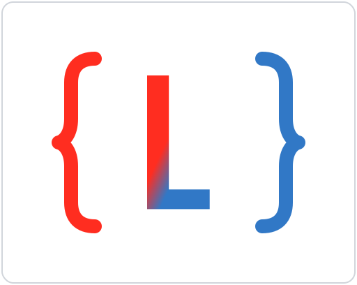

# Tolki JS

Use the PHP Laravel framework utilities in your JavaScript projects.

## Backstory

I love [Laravel](https://laravel.com/). I love JavaScript [frontend frameworks](https://vuejs.org/). I love how [Inertia JS](https://inertiajs.com/) bridged the gap between these two worlds. I just wish I could use the incredible helper functions that Laravel provides in my JavaScript code with proper TypeScript support and tree-shaking capabilities.

After making them, I then decided to open-source these utilities so that others could benefit from them as well. Thus, the Tolki JS project was born.

## Published Packages

| Package                            | Description                                                             |                                                                                                        |
| ---------------------------------- | ----------------------------------------------------------------------- | ------------------------------------------------------------------------------------------------------ |
| [`@tolki/enum`](./packages/enum)   | Utilities for working with enums like PHP's Enum class.                 |    |
| [`@tolki/num`](./packages/num)     | Utilities for working with numbers like Laravel's Num class.            |      |
| [`@tolki/str`](./packages/str)     | Utilities for working with strings like Laravel's Str class.            |      |
| [`@tolki/types`](./packages/types) | Utility TypeScript types for Tolki packages and Laravel HTTP responses. |  |

## In Progress Packages

| Package                                      | Description                                                              |
| -------------------------------------------- | ------------------------------------------------------------------------ |
| [`@tolki/all`](./packages/all)               | A wrapper package to install all Tolki packages at once.                 |
| [`@tolki/arr`](./packages/arr)               | Utilities for working with arrays.                                       |
| [`@tolki/collection`](./packages/collection) | A Collection class similar to Laravel's Collection class.                |
| [`@tolki/data`](./packages/data)             | Utilities for working with JavaScript objects and arrays in one package. |
| [`@tolki/obj`](./packages/obj)               | Utilities for working with JavaScript objects.                           |
